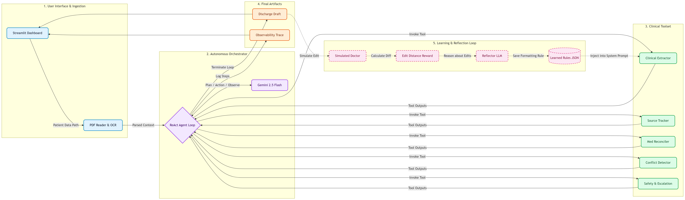

<div align="center">

# Clinical Discharge Summary Generation with Agentic AI

Safety-focused clinical document understanding, structured discharge summary generation, evidence attribution, medication reconciliation, and continuous learning through clinician feedback.


</div>

---

## Overview

An agentic AI system that transforms unstructured clinical PDFs into structured discharge summaries while enforcing safety, traceability, medication review, clinician escalation, and continuous learning.

### Key Capabilities

- Clinical information extraction from PDFs
- OCR support for scanned documents
- Structured discharge summary generation
- Source attribution and evidence tracking
- Medication reconciliation
- Drug interaction review
- Safety escalation engine
- Agent traceability and audit logs
- Reflection-based learning from clinician edits
- Interactive Streamlit dashboard

---

## Architecture

<p align="center">
  
</p>

### Pipeline

```text
Clinical PDFs
      │
      ▼
PDF Parsing + OCR
      │
      ▼
Clinical Extraction Agent
      │
      ├── Source Attribution
      ├── Medication Reconciliation
      ├── Drug Interaction Review
      ├── Safety Escalation
      └── Confidence Scoring
      │
      ▼
Structured Discharge Summary
      │
      ▼
JSON Output + Dashboard + Trace Logs

Part 2

Generated Summary
      │
      ▼
Clinician Edit
      │
      ▼
Reflection Agent
      │
      ▼
Learned Rules Memory
      │
      ▼
Future Prompt Injection
```

---

## Core Features

### Clinical Extraction Agent

Extracts:

- Demographics
- Admission Date
- Discharge Date
- Principal Diagnosis
- Secondary Diagnoses
- Hospital Course
- Procedures
- Medications
- Allergies
- Follow-up Instructions
- Pending Results
- Discharge Condition

### Safety-First Design

The system never fabricates missing information.

If information cannot be confidently extracted:

- Returns `NOT_FOUND`
- Generates clinician review flags
- Preserves uncertainty
- Avoids hallucination

### Source Attribution

Each extracted field contains:

- Confidence score
- Supporting evidence
- Source document reference
- Page-level traceability

### Medication Reconciliation

Automatically identifies:

- Added medications
- Removed medications
- Modified medications

### Agent Trace

Every run records:

- Agent action
- Reasoning step
- Tool execution
- Processing status

---

## Reflection Learning Framework

Instead of retraining the model, the system learns clinician preferences through reflection.

### Workflow

```text
Generated Summary
      ↓
Clinician Edit
      ↓
Reflection Agent
      ↓
Rule Extraction
      ↓
Memory Store
      ↓
Future Prompt Injection
```

### Example

Generated:

```text
Hemodynamically stable
```

Edited:

```text
Clinically stable at discharge
```

Learned Rule:

```text
Prefer "Clinically stable at discharge"
instead of "Hemodynamically stable"
when appropriate.
```

---

## Technology Stack

| Category | Technology |
|-----------|-----------|
| LLM | Gemini 2.5 Flash |
| Framework | LangChain |
| OCR | Tesseract |
| PDF Processing | PyMuPDF |
| Backend | Python |
| Frontend | Streamlit |
| Data | JSON, Pandas |

---

## Project Structure

```text
Dscribe-Agent/

├── agents/
├── tools/
├── learning/
├── memory/
├── outputs/
├── traces/
├── docs/
│   └── architecture.png
│
├── config/
├── patient_data/
├── main.py
├── streamlit_app.py
├── requirements.txt
└── README.md
```

---

## Running the Project

### Install

```bash
pip install -r requirements.txt
```

### Configure

```env
GOOGLE_API_KEY=YOUR_API_KEY
```

### Run Pipeline

```bash
python main.py
```

### Launch Dashboard

```bash
streamlit run streamlit_app.py
```

### Run Learning Loop

```bash
python learning/run_learning.py
```

---

## Outputs

The system generates:

- Structured clinical JSON
- Human-readable discharge summary
- Evidence attribution reports
- Medication reconciliation results
- Agent trace logs
- Learned clinician preferences

---

## Design Philosophy

1. Safety over completeness
2. Traceability over opacity
3. Human oversight over automation
4. Continuous improvement through feedback

This system is designed to augment clinical workflows while maintaining strong safety and explainability guarantees.
